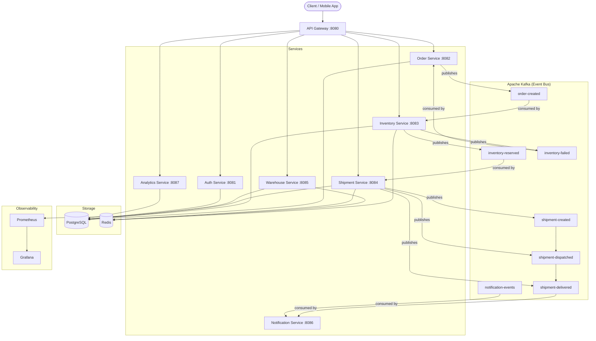
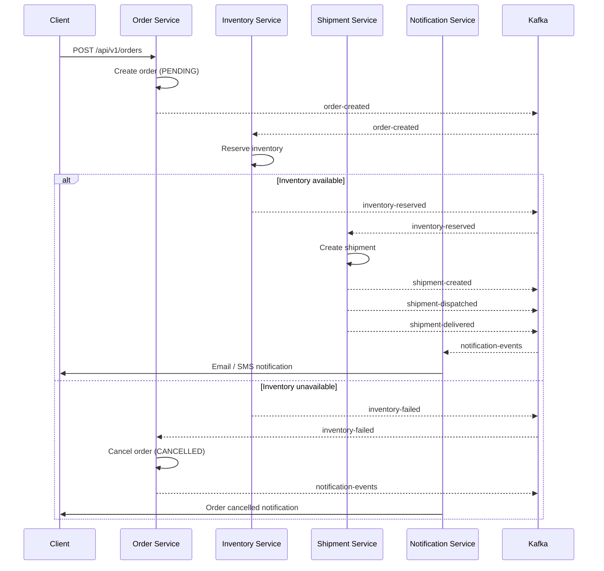

# Distributed Logistics & Warehouse Management Platform

A production-grade microservice platform for managing end-to-end logistics operations including order processing, inventory management, shipment tracking, and warehouse operations.

---

## Architecture



### Saga: Order Fulfillment Flow



---

## Project Structure

```
logistics-platform/
├── common/                         # Shared library (DTOs, events, enums, utils)
├── api-gateway/                    # Spring Cloud Gateway – routing & auth filter
├── auth-service/                   # JWT authentication & user management
├── order-service/                  # Order lifecycle management
├── inventory-service/              # Stock tracking & reservation
├── shipment-service/               # Shipment creation & tracking
├── warehouse-service/              # Warehouse & location management
├── notification-service/           # Email / SMS / push notifications
├── analytics-service/              # Reporting & metrics aggregation
├── infrastructure/
│   ├── db/init.sql                 # Database schema initialization
│   ├── prometheus/prometheus.yml   # Scrape configuration
│   ├── grafana/                    # Dashboards & provisioning
│   └── aws/                        # ECS task definitions & IAM policies
├── docker-compose.yml
└── pom.xml                         # Parent Maven POM
```

---

## Technology Stack

| Layer | Technology |
|---|---|
| Language | Java 21 |
| Framework | Spring Boot 3.2 |
| Build | Maven (multi-module) |
| Gateway | Spring Cloud Gateway |
| Auth | Spring Security + JWT |
| Persistence | Spring Data JPA + PostgreSQL 16 |
| Cache | Spring Data Redis 7 |
| Messaging | Apache Kafka 3.6 |
| API Docs | SpringDoc OpenAPI 3 (Swagger UI) |
| Observability | Spring Actuator + Micrometer + Prometheus + Grafana |
| Containers | Docker + Docker Compose |
| CI/CD | GitHub Actions |
| Cloud | AWS ECS (Fargate) |

---

## Getting Started

### Prerequisites

- Java 21+
- Maven 3.9+
- Docker & Docker Compose

### Build All Services

```bash
# Install common module and build everything
mvn clean install -DskipTests

# Or build a single service
mvn clean package -pl order-service -am -DskipTests
```

### Run with Docker Compose

```bash
# Start infrastructure only (Kafka, Postgres, Redis, Prometheus, Grafana)
docker-compose up -d zookeeper kafka postgres redis prometheus grafana

# Start all services
docker-compose up -d

# Watch logs
docker-compose logs -f order-service

# Tear down
docker-compose down -v
```

### Run a Service Locally

```bash
cd order-service
mvn spring-boot:run -Dspring-boot.run.profiles=local
```

---

## Service Ports

| Service | Port | Swagger UI |
|---|---|---|
| API Gateway | 8080 | http://localhost:8080/swagger-ui.html |
| Auth Service | 8081 | http://localhost:8081/swagger-ui.html |
| Order Service | 8082 | http://localhost:8082/swagger-ui.html |
| Inventory Service | 8083 | http://localhost:8083/swagger-ui.html |
| Shipment Service | 8084 | http://localhost:8084/swagger-ui.html |
| Warehouse Service | 8085 | http://localhost:8085/swagger-ui.html |
| Notification Service | 8086 | http://localhost:8086/swagger-ui.html |
| Analytics Service | 8087 | http://localhost:8087/swagger-ui.html |

| Infrastructure | Port |
|---|---|
| Kafka UI | http://localhost:8090 |
| Prometheus | http://localhost:9090 |
| Grafana | http://localhost:3000 (admin / admin_secret) |
| PostgreSQL | localhost:5432 |
| Redis | localhost:6379 |

---

## Kafka Topics

| Topic | Producer | Consumer | Description |
|---|---|---|---|
| `order-created` | Order Service | Inventory Service | New order placed |
| `inventory-reserved` | Inventory Service | Shipment Service | Stock successfully reserved |
| `inventory-failed` | Inventory Service | Order Service | Stock reservation failed |
| `shipment-created` | Shipment Service | Notification Service | Shipment record created |
| `shipment-dispatched` | Shipment Service | Notification Service | Shipment picked up by carrier |
| `shipment-delivered` | Shipment Service | Notification Service | Package delivered |
| `notification-events` | Multiple | Notification Service | Generic notification fan-out |

All topics use a Dead-Letter Topic (`*.DLT`) pattern with 3 retry attempts and exponential back-off.

---

## API Overview

### Auth Service
```
POST   /api/v1/auth/register        Register a new user
POST   /api/v1/auth/login           Authenticate and receive JWT
POST   /api/v1/auth/refresh         Refresh access token
POST   /api/v1/auth/logout          Invalidate token
GET    /api/v1/users/me             Get current user profile
```

### Order Service
```
POST   /api/v1/orders               Create a new order
GET    /api/v1/orders               List orders (paginated)
GET    /api/v1/orders/{id}          Get order by ID
PUT    /api/v1/orders/{id}/cancel   Cancel an order
GET    /api/v1/orders/{id}/status   Get order status
```

### Inventory Service
```
GET    /api/v1/inventory            List inventory items
GET    /api/v1/inventory/{sku}      Get item by SKU
POST   /api/v1/inventory            Create inventory item
PUT    /api/v1/inventory/{id}       Update stock levels
POST   /api/v1/inventory/reserve    Reserve stock (internal)
```

### Shipment Service
```
POST   /api/v1/shipments            Create shipment
GET    /api/v1/shipments/{id}       Get shipment details
GET    /api/v1/shipments/track/{trackingNumber}  Track shipment
PUT    /api/v1/shipments/{id}/status  Update status
```

### Warehouse Service
```
GET    /api/v1/warehouses           List warehouses
POST   /api/v1/warehouses           Create warehouse
GET    /api/v1/warehouses/{id}      Get warehouse details
GET    /api/v1/warehouses/{id}/locations  Get storage locations
```

---

## Health Checks

All services expose Spring Boot Actuator endpoints:

```
GET /actuator/health       Liveness + readiness
GET /actuator/info         Build info
GET /actuator/metrics      Micrometer metrics
GET /actuator/prometheus   Prometheus scrape endpoint
```

---

## Deployment Architecture (AWS)

```
Internet
    │
    ▼
Route 53 (DNS)
    │
    ▼
Application Load Balancer
    │
    ├──▶ ECS Service: api-gateway       (Fargate, 2–10 tasks)
    │       └──▶ ECS Service: auth-service
    │       └──▶ ECS Service: order-service
    │       └──▶ ECS Service: inventory-service
    │       └──▶ ECS Service: shipment-service
    │       └──▶ ECS Service: warehouse-service
    │       └──▶ ECS Service: analytics-service
    │
    ├──▶ Amazon RDS (PostgreSQL Multi-AZ)
    ├──▶ Amazon ElastiCache (Redis)
    ├──▶ Amazon MSK (Managed Kafka)
    └──▶ Amazon CloudWatch (Logs + Metrics)
```

---

## Future Improvements

- [ ] Service mesh with AWS App Mesh or Istio
- [ ] Distributed tracing with AWS X-Ray or Jaeger
- [ ] CQRS pattern for analytics read models
- [ ] GraphQL API layer
- [ ] OAuth2 / OIDC integration (Keycloak)
- [ ] gRPC for internal service-to-service calls
- [ ] Multi-region active-active deployment
- [ ] Chaos engineering with Chaos Monkey
- [ ] API rate limiting and circuit breaker (Resilience4j)
- [ ] Event sourcing with Kafka Streams

---

## Contributing

1. Fork the repository
2. Create a feature branch: `git checkout -b feature/my-feature`
3. Commit changes: `git commit -m 'feat: add my feature'`
4. Push to branch: `git push origin feature/my-feature`
5. Open a Pull Request

---

## License

MIT License — see [LICENSE](LICENSE) for details.